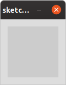
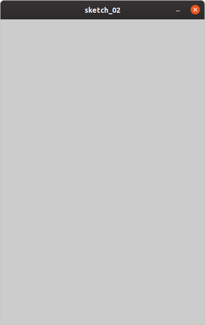
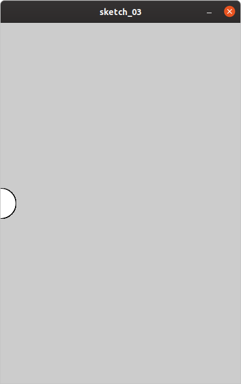
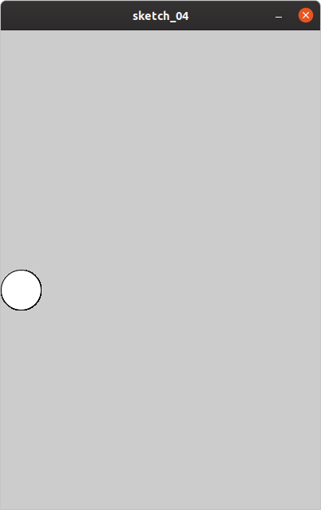
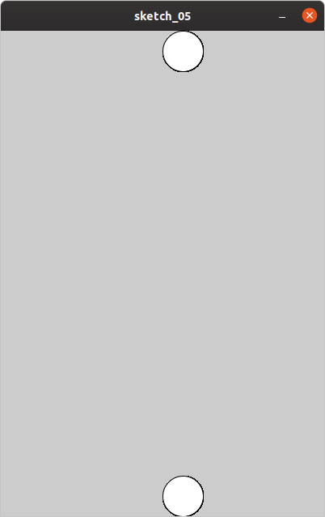
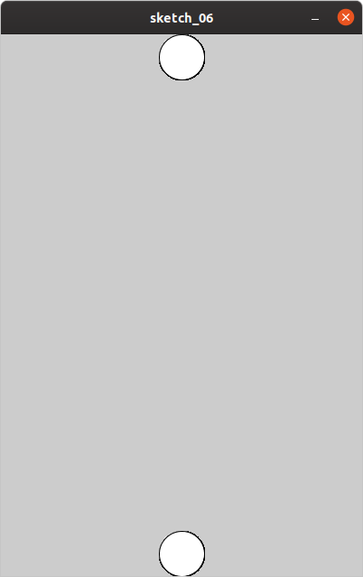
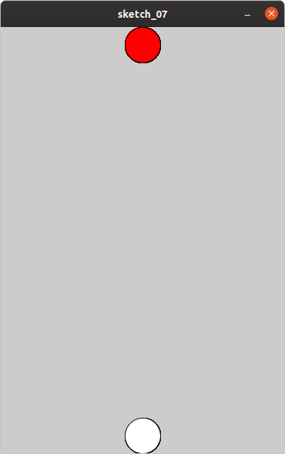

# 01 两个圆圈

我们的目标很明确，是做一个螃蟹大战蜘蛛的游戏。

因此，我们需要绘制一个螃蟹及一个蜘蛛。但绘制它们并不容易，所以我们有两种做法：

1）直接使用图片

2）先用一个简单图形代替

我们使用第二种，使用一个圆圈代替螃蟹，使用另一个圆圈代替蜘蛛。


现在我们要开始了，打开processing，输入如下代码：

```
void setup() {
  
}
void draw() {
  
}

```

执行后，我们可以看到效果：



对于processing，必备的两个方法就是setup和draw。

setup方法用于初始化一些参数，draw是循环绘制。它为我们定义好了接口，只要我们在这两个方法里写代码就可以了。

但是这么小的窗口，显然不能玩游戏，因此我们把它设置大一些，在setup里增加一句：

```
size(400,600);
```

完整的代码是：

```
void setup() {
  size(400,600);
}
void draw() {
  
}

```

现在，它变大了。可以看到，这样的大小，是可以玩游戏的。


接下来，我们就要画圈圈了。显然，需要写在draw方法里。我们让圈圈的坐标为x=0，y=300，宽和高都为50：

```
ellipse(0,300,50,50);
```

全部代码为：

```
void setup() {
  size(400,600);
}
void draw() {
  ellipse(0,300,50,50);
}

```

然而，发现这个圈圈竟然偏了。



原来，ellipse方法默认是居中的，即把x当成自身的中间点：（x坐标+宽度）/2。因此，我们需要设置它为左对齐：

```
ellipseMode(LEFT);
```

既然是设置，显然加在setup方法里，相应地，全部代码为：

```
void setup() {
  size(400,600);
  ellipseMode(LEFT);
}
void draw() {
  ellipse(0,300,50,50);
}

```



现在，我们终于画出了一个圈圈。接下来，我们画2个，而且画在中间，x坐标为200，因为宽度为400，这样就在中间了：

```
void setup() {
  size(400,600);
  ellipseMode(LEFT);
}
void draw() {
  ellipse(200,0,50,50);
  ellipse(200,600-50,50,50);
}
```



然而看图有些偏右，为什么呢？原来我们之前设置了画圆形为左对齐，所以圆圈从中间x=200画，因此整体偏右。为了让它居中，我们手动把x往左边调一调，即减去圆圈宽度一半：

```
  ellipse(200-50/2,0,50,50);
  ellipse(200-50/2,600-50,50,50);
```

全部代码为：

```
void setup() {
  size(400,600);
  ellipseMode(LEFT);
}
void draw() {
  ellipse(200-50/2,0,50,50);
  ellipse(200-50/2,600-50,50,50);
}
```



因为螃蟹大战蜘蛛，蜘蛛会从上面往下掉，所以我们要区分出螃蟹与蜘蛛。我们采用颜色区分，把蜘蛛设置为红色，把螃蟹设置为白色。

```
fill(255,0,0);//红色
fill(255,255,255);//白色
```

需要注意的是，设置颜色要在绘制图形之前，所以全部代码为：

```
void setup() {
  size(400,600);
  ellipseMode(LEFT);
}
void draw() {
  fill(255,0,0);//红色
  ellipse(200-50/2,0,50,50);
  
  fill(255,255,255);//白色
  ellipse(200-50/2,600-50,50,50);
}
```

最终效果为：



但是现在它还不能动，因此，我们要想办法，让它动起来。请看下一节课。