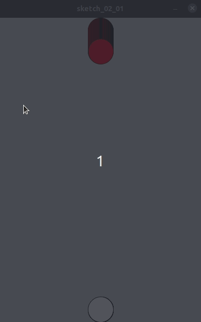
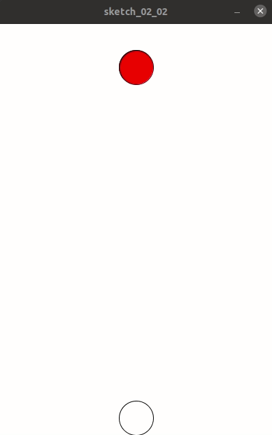
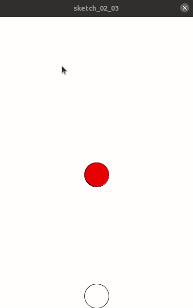

## 圈圈动起来

为了让圈圈动起来，我们需要对绘制圈圈的代码进行更改，把具体的数值变成一个可以改变的变量。

首先，我们让代表蜘蛛的红色圆圈可以从上往下运动，这样我们使用y来代表蜘蛛的y坐标。

相应地，我们要在setup的上面先定义一下变量：

```
float y;
```

然后，我们在setup里设置y的值为0：

```
y=0;
```

找到之前的代码：

```
ellipse(200-50/2,0,50,50);
```

更改为：

```
ellipse(200-50/2,y,50,50);
```

为了让它动起来，我们需要站在draw里，改变y的值，并设置一个延时：

```
y+=1;
delay(100);
```

全部代码为：

```
float y;
void setup() {
  size(400, 600);
  ellipseMode(LEFT);
  y=0;
}
void draw() {
  fill(255, 0, 0);
  ellipse(200-50/2, y, 50, 50);
  fill(255, 255, 255);
  ellipse(200-50/2, 600-50, 50, 50);
  y+=1;
  delay(100);
}

```

然而，运行后却发现，不对劲。



原来，draw方法是循环的，所以每次都是叠加画上去。因此，我们需要增加一个清屏：

```
background(255);
```

在processing中，清屏就是重新设置背景色。

全部代码为：

```
float y;
void setup() {
  size(400, 600);
  ellipseMode(LEFT);
  y=0;
}
void draw() {
  background(255);
  fill(255, 0, 0);
  ellipse(200-50/2, y, 50, 50);
  fill(255, 255, 255);
  ellipse(200-50/2, 600-50, 50, 50);
  y+=1;
  delay(100);
}
```

现在，运行效果为：



我们可以继续调节，让它更顺滑。

```
y+=1;
//delay(10);
```

事实证明delay没什么用，所以给注释掉了。



可以看到，截动图后似乎并不顺滑。不过没关系，主要是它能动。现在，红色圈圈代表的蜘蛛已经碰到螃蟹了，这个时候，应该游戏结束。

所以，下一节，我们来做一个碰撞检测。