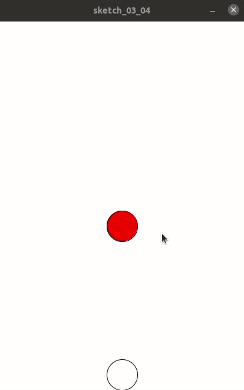

## 碰撞检测

碰撞检测有很多方法，我们使用最普通的方法，即计算两个圆圈是否存在交集。

为了计算是否存在交集，因此我们需要对代码进行改动，分别设置螃蟹及蜘蛛的x坐标与y坐标。

```
float crab_x, crab_y;
float spider_x, spider_y;
```

在setup中：

```
  spider_x=200-50/2;
  spider_y=0;
  crab_x=200-50/2;
  crab_y=600-50;
```

在draw中：

```
  background(255);
  fill(255, 0, 0);
  ellipse(spider_x, spider_y, 50, 50);
  fill(255, 255, 255);
  ellipse(crab_x, crab_y, 50, 50);
  spider_y+=1;
```

以及，之前代码中的：

```
200-50/2
```

也要对两者的长宽设置一个变量：

```
float crab_w,crab_h;
float spider_w,spider_h;
```

相应地，setup变为：

```
  size(400, 600);
  ellipseMode(LEFT);
  crab_w=50;
  crab_h=50;
  spider_w=50;
  spider_h=50;
  spider_x=200-spider_w/2;
  spider_y=0;
  crab_x=200-crab_w/2;
  crab_y=600-crab_h;
```

相应地，draw则变为：

```
  background(255);
  fill(255, 0, 0);
  ellipse(spider_x, spider_y, spider_w, spider_h);
  fill(255, 255, 255);
  ellipse(crab_x, crab_y, crab_w, crab_h);
  spider_y+=1;
```

全部代码为：

```
float crab_x, crab_y;
float spider_x, spider_y;

float crab_w,crab_h;
float spider_w,spider_h;

void setup() {
  size(400, 600);
  ellipseMode(LEFT);
  crab_w=50;
  crab_h=50;
  spider_w=50;
  spider_h=50;
  spider_x=200-spider_w/2;
  spider_y=0;
  crab_x=200-crab_w/2;
  crab_y=600-crab_h;
}
void draw() {
  background(255);
  fill(255, 0, 0);
  ellipse(spider_x, spider_y, spider_w, spider_h);
  fill(255, 255, 255);
  ellipse(crab_x, crab_y, crab_w, crab_h);
  spider_y+=1;
}

```


实际上运行效果和上一次没什么区别。

下面，开始做碰撞检测。

```
  if (spider_x>=crab_x && spider_x<=crab_x+crab_w) {
    if (spider_y>=crab_y && spider_y<=crab_y+crab_h) {
      background(0);
    }
  }
```

全部代码为：

```
float crab_x, crab_y;
float spider_x, spider_y;

float crab_w, crab_h;
float spider_w, spider_h;

void setup() {
  size(400, 600);
  ellipseMode(LEFT);
  crab_w=50;
  crab_h=50;
  spider_w=50;
  spider_h=50;
  spider_x=200-spider_w/2;
  spider_y=0;
  crab_x=200-crab_w/2;
  crab_y=600-crab_h;
}
void draw() {
  background(255);
  fill(255, 0, 0);
  ellipse(spider_x, spider_y, spider_w, spider_h);
  fill(255, 255, 255);
  ellipse(crab_x, crab_y, crab_w, crab_h);
  spider_y+=1;
  if (spider_x>=crab_x && spider_x<=crab_x+crab_w) {
    if (spider_y>=crab_y && spider_y<=crab_y+crab_h) {
      background(0);
    }
  }
}

```

这样，只要发生碰撞，屏幕就会变成黑色，可是，这个效果竟然是黑了一瞬间代表蜘蛛的圈圈又往下走了。


另外算法有问题，刚才写的是完全重合，而不是交集。

因此我们做如下改进，如果检测到碰撞，则让draw停止绘制。

这很简单，我们只需要增加一个loop的布尔值变量。

```
boolean loop;
```

并在setup设置：

```
loop=true;
```

相应地，draw也要改变（这里是伪代码）：

```
  if (loop) {
    //这里是正常时的代码
    if (发生碰撞检测){
        loop=false;
      }
    }
```

当然，碰撞检测也要变成：

```
if (spider_x>=crab_x && spider_x<=crab_x+crab_w) {
      if (spider_y+spider_h>=crab_y && spider_y+spider_h<=crab_y+crab_h) {
        background(0);
        loop=false;
      }
    }
```

最后，全部代码为：

```
float crab_x, crab_y;
float spider_x, spider_y;

float crab_w, crab_h;
float spider_w, spider_h;

boolean loop;

void setup() {
  loop=true;
  size(400, 600);
  ellipseMode(LEFT);
  crab_w=50;
  crab_h=50;
  spider_w=50;
  spider_h=50;
  spider_x=200-spider_w/2;
  spider_y=0;
  crab_x=200-crab_w/2;
  crab_y=600-crab_h;
}
void draw() {
  if (loop) {
    background(255);
    fill(255, 0, 0);
    ellipse(spider_x, spider_y, spider_w, spider_h);
    fill(255, 255, 255);
    ellipse(crab_x, crab_y, crab_w, crab_h);
    spider_y+=1;
    if (spider_x>=crab_x && spider_x<=crab_x+crab_w) {
      if (spider_y+spider_h>=crab_y && spider_y+spider_h<=crab_y+crab_h) {
        background(0);
        loop=false;
      }
    }
  }
}

```

现在，碰撞检测已经可以工作了：


为了效果逼真，我们再加上一个“Game over”：

```
textFont(createFont(PFont.list()[0], 30));
text("GAME OVER", 200, 50);
```



不过强迫症受不了不居中，再改一下：

```
textAlign(CENTER);
textFont(createFont(PFont.list()[0], 30));
text("GAME OVER", 200, 300);
```

全部代码为：

```
float crab_x, crab_y;
float spider_x, spider_y;

float crab_w, crab_h;
float spider_w, spider_h;

boolean loop;

void setup() {
  loop=true;
  size(400, 600);
  ellipseMode(LEFT);
  crab_w=50;
  crab_h=50;
  spider_w=50;
  spider_h=50;
  spider_x=200-spider_w/2;
  spider_y=0;
  crab_x=200-crab_w/2;
  crab_y=600-crab_h;
}
void draw() {
  if (loop) {
    background(255);
    fill(255, 0, 0);
    ellipse(spider_x, spider_y, spider_w, spider_h);
    fill(255, 255, 255);
    ellipse(crab_x, crab_y, crab_w, crab_h);
    spider_y+=1;
    if (spider_x>=crab_x && spider_x<=crab_x+crab_w) {
      if (spider_y+spider_h>=crab_y && spider_y+spider_h<=crab_y+crab_h) {
        background(0);
        textAlign(CENTER);
        textFont(createFont(PFont.list()[0], 30));
        text("GAME OVER", 200, 300);
        loop=false;
      }
    }
  }
}

```

最终效果：


