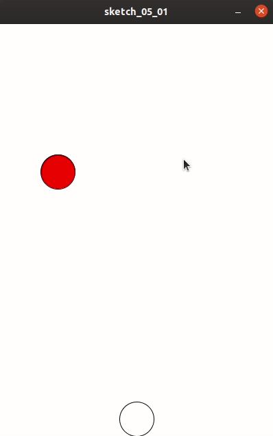
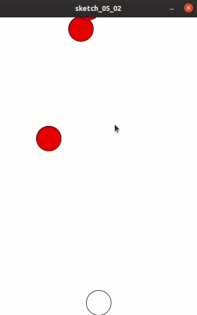
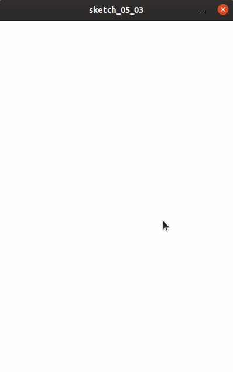

## 随机产生蜘蛛

为了产生随机蜘蛛，我们需要对代码进行改写。把蜘蛛写成一个类，这样可以对蜘蛛构造属性与方法。以便于循环数组去绘制蜘蛛。

现在，把蜘蛛封装成一个类，并保存在spider.pde：

```
class Spider {
  float x, y, w, h;
  Spider() {
    w=50;
    h=50;
    x=random(0, 400);
    y=0-h;
  }
  void run() {
    y+=1;
  }
  void draw() {
    fill(255, 0, 0);
    ellipse(x, y, w, h);
  }
}

```

其中：

```
x=random(0, 400-w);
```

意思是蜘蛛的x坐标是在游戏屏幕区域的随机数。由于蜘蛛有宽度，因此屏幕右端要减掉⑦宽度：

```
400-w
```

相应地，在主文件中，可删除之前与蜘蛛相关的变量，而是新建一个蜘蛛对象：

```
Spider spider;
```

在setup中，初始化蜘蛛对象：

```
spider = new Spider();
```

并把的draw改为类对象的调用：

```
spider.run();
spider.draw();
```

把碰撞检测也从以前的变量变为对象调用：

```
if (spider.x>=crab_x && spider.x<=crab_x+crab_w) {
      if (spider.y+spider.h>=crab_y && spider.y+spider.h<=crab_y+crab_h) {
        background(0);
        textAlign(CENTER);
        textFont(createFont(PFont.list()[0], 30));
        text("GAME OVER", 200, 300);
        loop=false;
      }
    }
```

效果如下：



蜘蛛从一个随机x坐标出现并下走。

但是一个并不够啊，需要多多产生蜘蛛。怎么办？

我们需要一个数组：

```
ArrayList<Spider> spiders;
```

相应地，setup：

```
spiders = new ArrayList<Spider>();
```

而我们还需要在draw中设置一个概率，即有多少概率能产生一个蜘蛛，毕竟draw是循环的，你可不想蜘蛛出现太多吧:

```
if ((int)random(0, 100)==1) {
	spiders.add(new Spider());
}
```

之后，遍历蜘蛛数组，让每个蜘蛛运行及绘制：

```
for (Spider spider : spiders) {
	spider.run();
	spider.draw();
}
```

另外，碰撞检测函数也要写到循环里：

```
for (Spider spider : spiders) {
      spider.run();
      spider.draw();
      if (spider.x>=crab_x && spider.x<=crab_x+crab_w) {
        if (spider.y+spider.h>=crab_y && spider.y+spider.h<=crab_y+crab_h) {
          background(0);
          textAlign(CENTER);
          textFont(createFont(PFont.list()[0], 30));
          text("GAME OVER", 200, 300);
          loop=false;
        }
      }
    }
```




可以看到，产生了很多代表蜘蛛的红色圈圈。不过，似乎碰撞检测有些不太灵敏？

原来是有些超出游戏屏幕范围的蜘蛛没有被销毁。因此我们优化一下：

```
for (int i=0; i<spiders.size(); i++) {
      Spider spider = spiders.get(i);
      spider.run();
      spider.draw();
      if (spider.x>=crab_x && spider.x<=crab_x+crab_w) {
        if (spider.y+spider.h>=crab_y && spider.y+spider.h<=crab_y+crab_h) {
          background(0);
          textAlign(CENTER);
          textFont(createFont(PFont.list()[0], 30));
          text("GAME OVER", 200, 300);
          loop=false;
        }
      }
      if(spider.y>600){
        spiders.remove(i);
      }
      fill(255, 255, 255);
      ellipse(crab_x, crab_y, crab_w, crab_h);
    }

```



不过结尾发现Game over的颜色变了，原来有个疏忽，没有在结束时设置颜色。我们现在补到text函数的前面：

```
fill(255);
text("GAME OVER", 200, 300);
```

上一个代码还有一个错误，在每一次循环spider时都绘制一次螃蟹，其实可以拿出来，放在绘制蜘蛛的外面，现在全部代码为：

```
float crab_x, crab_y;
float crab_w, crab_h;

ArrayList<Spider> spiders;
boolean loop;

void setup() {
  spiders = new ArrayList<Spider>();
  loop=true;
  size(400, 600);
  ellipseMode(LEFT);
  crab_w=50;
  crab_h=50;
  crab_x=200-crab_w/2;
  crab_y=600-crab_h;
}

void draw() {
  if (loop) {
    background(255);
    if ((int)random(0, 100)==1) {
      spiders.add(new Spider());
    }
    fill(255, 255, 255);
    ellipse(crab_x, crab_y, crab_w, crab_h);
    for (int i=0; i<spiders.size(); i++) {
      if (loop) {
        Spider spider = spiders.get(i);
        spider.run();
        spider.draw();
        if (spider.x>=crab_x && spider.x<=crab_x+crab_w) {
          if (spider.y+spider.h>=crab_y && spider.y+spider.h<=crab_y+crab_h) {
            background(0);
            textAlign(CENTER);
            textFont(createFont(PFont.list()[0], 30));
            fill(255);
            text("GAME OVER", 200, 300);
            loop=false;
          }
        }
        if (spider.y>600) {
          spiders.remove(i);
        }
      }
    }
  }
}

void keyPressed() {
  if (key == '1') {
    crab_x-=2;
    if (crab_x<=0) {
      crab_x=0;
    }
  }
  if (key == '0') {
    crab_x+=2;
    if (crab_x>=400-crab_w) {
      crab_x=400-crab_w;
    }
  }
}
```

代码路径： Crab-vs-Spiders/05/sketch_05_04