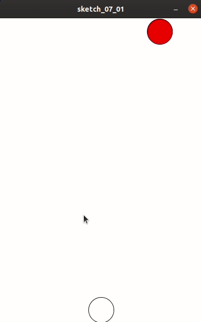
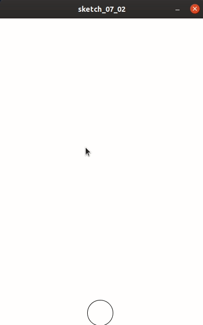

## 能发射炮弹的螃蟹

光躲避是没有意思的，我们应该增加一个发射炮弹的功能。

因此，我们新建一个bullet.pde文件，写一个类：

```
class Bullet {
  float x, y;
  float w, h;
  Bullet(float x, float y) { 
    this.x=x;
    this.y=y;
    this.w=10;
    this.h=10;
  }
  void run() {
    this.y-=1;
  }
  void draw() {
    fill(255, 255, 0);
    ellipse(x-w/2, y, w, h);
  }
}
```

接下来，在主文件中建立一个键盘事件捕获，从而实现发射炮弹的功能：

```
if (key == ' ') {
   if (loop) {
     fire();
   }
}
```

因此我们还需要建立一个fire的方法。

```
void fire(){
  
}
```

先留空，因为我们还需要一个炮弹的数组：

```
ArrayList<Bullet> bullets;
```

并在init里定义：

```
bullets = new ArrayList<Bullet>();
```

现在，fire是这样了：

```
void fire(){
  bullets.add(new Bullet(crab_x+crab_w/2,crab_y));
}
```

为了让炮弹生效，我们需要在draw中，对炮弹数组进行循环绘制:

```
for (int bi=0; bi<bullets.size(); bi++) {
      Bullet bullet = bullets.get(bi);
      bullet.run();
      bullet.draw();
}
```



不过，虽然能发射炮弹，但是并没有消灭蜘蛛。所以，还需要计算炮弹是否打中了蜘蛛。

```
for (int si=0; si<spiders.size(); si++) {
        Spider spider = spiders.get(si);
        if (abs(spider.x-bullet.x)<spider.w && abs(spider.y-bullet.y)<spider.h) {
          bullets.remove(bi);
          spiders.remove(si);
	}
}
```

以及，炮弹如果超过游戏屏幕范围，则自动销毁。

```
if (bullet.y<0-bullet.h) {
   bullets.remove(bi);
}
```

现在，主文件代码为：

```
float crab_x, crab_y;
float crab_w, crab_h;

ArrayList<Spider> spiders;
ArrayList<Bullet> bullets;
boolean loop;

void init() {
  spiders = new ArrayList<Spider>();
  bullets = new ArrayList<Bullet>();
  crab_w=50;
  crab_h=50;
  crab_x=200-crab_w/2;
  crab_y=600-crab_h;
  loop=true;
}

void setup() {
  size(400, 600);
  ellipseMode(LEFT);
  init();
}

void draw() {
  if (loop) {
    background(255);
    if ((int)random(0, 100)==1) {
      spiders.add(new Spider());
    }
    fill(255, 255, 255);
    ellipse(crab_x, crab_y, crab_w, crab_h);
    for (int i=0; i<spiders.size(); i++) {
      if (loop) {
        Spider spider = spiders.get(i);
        spider.run();
        spider.draw();
        if (abs(spider.x-crab_x)<spider.w/1.3 && abs(spider.y-crab_y)<crab_h/1.3) {
          background(0);
          textAlign(CENTER);
          textFont(createFont(PFont.list()[0], 50));
          fill(255);
          text("GAME OVER", 200, 300-20);
          textFont(createFont(PFont.list()[0], 20));
          text("Press key r to restart", 200, 300+20);
          loop=false;
        }
        if (spider.y>600) {
          spiders.remove(i);
        }
      }
    }

    for (int bi=0; bi<bullets.size(); bi++) {
      Bullet bullet = bullets.get(bi);
      bullet.run();
      bullet.draw();
      if (bullet.y<0-bullet.h) {
        bullets.remove(bi);
      }
      for (int si=0; si<spiders.size(); si++) {
        Spider spider = spiders.get(si);
        if (abs(spider.x-bullet.x)<spider.w && abs(spider.y-bullet.y)<spider.h) {
          bullets.remove(bi);
          spiders.remove(si);
        }
      }
    }
  }
}

void fire() {
  bullets.add(new Bullet(crab_x+crab_w/2, crab_y));
}

void keyPressed() {
  if (key == '1') {
    crab_x-=2;
    if (crab_x<=0) {
      crab_x=0;
    }
  }
  if (key == '0') {
    crab_x+=2;
    if (crab_x>=400-crab_w) {
      crab_x=400-crab_w;
    }
  }
  if (key == 'r') {
    if (!loop) {
      init();
    }
  }
  if (key == ' ') {
    if (loop) {
      fire();
    }
  }
}

```



虽然还很简陋，但是可以玩了。