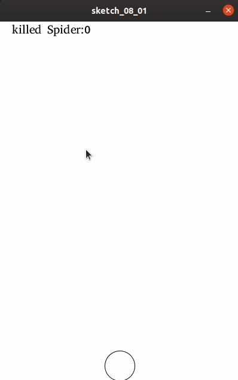

##　计数器记录游戏分数

虽然游戏已经可以玩了，但还不知道玩了多少分。或者说消灭了多少蜘蛛。所以，现在需要做一个统计。

```
int killedSpider;
```

在init中，初始为0：

```
killedSpider = 0;
```

然后在draw中，在游戏窗口左上方绘制消灭了多少个蜘蛛：

```
fill(0);
textFont(createFont(PFont.list()[0], 20));
text("killed Spider:" + killedSpider, 20, 20);
```

同样，需要在刚才的炮弹判断是否击中蜘蛛的地方，击中就把killedSpider变量加1：

```
killedSpider+=1；

```



至此，一个可以玩的游戏，终于写好了。