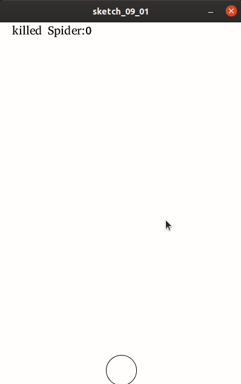
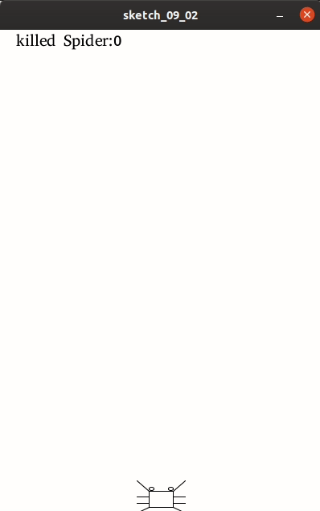

## 让蜘蛛与螃蟹更生动

对蜘蛛的draw方法进行更新：

```
  void draw() {
    line(x, y+h/2, x+w, y+h/2);
    line(x, y+h, x+w, y);
    line(x, y, x+w, y+h);
    line(x+w/2, 0, x+w/2, y+h/2);
    fill(255, 0, 0);
    ellipse(x+w/2-w/8, y+h/2-h/4, w/4, h/4);
    ellipse(x+w/2-w/16, y+h/2, w/8, h/8);
  }
```

蜘蛛的全部代码为：

```
class Spider {
  float x, y, w, h;
  Spider() {
    w=50;
    h=50;
    x=random(0, 400-w);
    y=0-h;
  }
  void run() {
    y+=1;
  }
  void draw() {
    line(x, y+h/2, x+w, y+h/2);
    line(x, y+h, x+w, y);
    line(x, y, x+w, y+h);
    line(x+w/2, 0, x+w/2, y+h/2);
    fill(255, 0, 0);
    ellipse(x+w/2-w/8, y+h/2-h/4, w/4, h/4);
    ellipse(x+w/2-w/16, y+h/2, w/8, h/8);
  }
}
```

效果如下：



可见蜘蛛终于有点蜘蛛的模样了。而且蜘蛛是从蜘蛛线上面滑下来的，效果更生动。

接下来，继续让螃蟹更生动。

