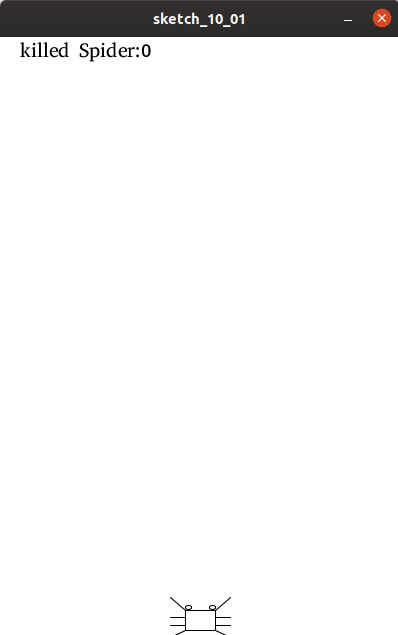

## 可暂停的游戏

到目前为止，我们的游戏已经可以运行了。不过，中途如果想暂停怎么办呢？

所以，需要增加一个暂停键。

```
boolean pause;
```

在init中：

```
pause = false;
```

在键盘事件捕获中：

```
if (key == 'p') {
  if (loop) {
   if (pause) {
      pause=false;
   } else {
      pause=true;
   }
  }
}
```


在draw中：

```
if(pause){
   //提示用户可以按p键继续。
}else{
   //以前的代码放在这里
}
```



代码位于： 

```
./10/sketch_10_01
```